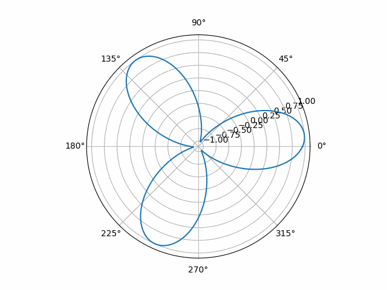
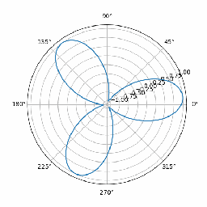

# 2d propeller aliasing simulation
Simple script for generating animation of propeller and simulating aliasing.





## Installation
Firstly, clone the repository from the github to your local folder with the following command:
```
git clone https://github.com/pietrykovsky/aliasing2d.git
```

Next, install all dependencies with pip:
```
pip install -r requirements.txt
```

Run following command to generate animations:
```
python main.py
or
python3 main.py
```